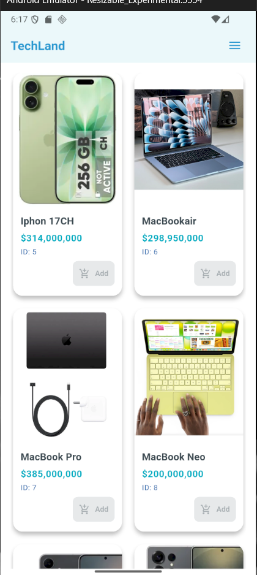
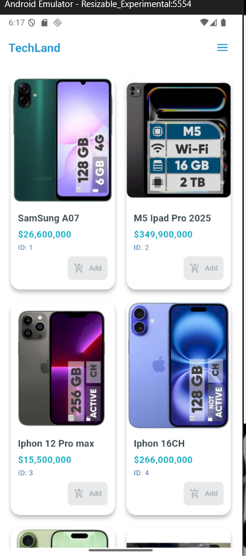
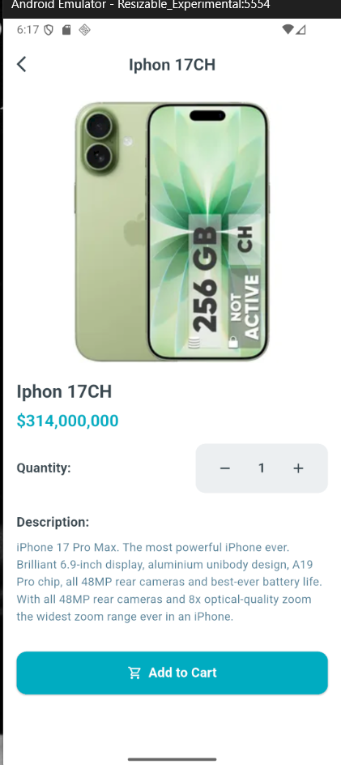
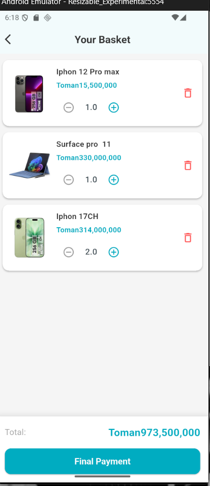
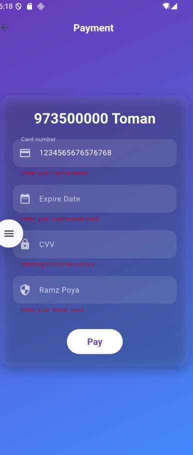
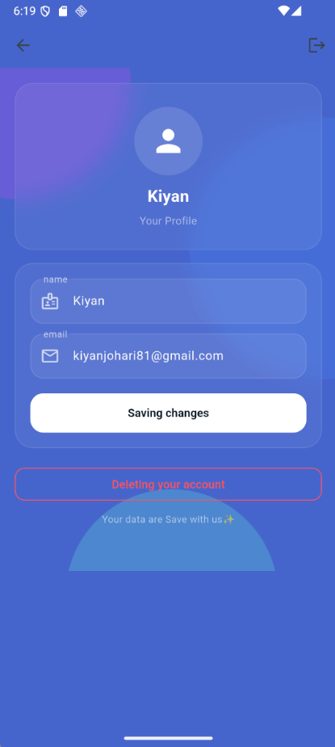

🏪TechLand Store App
A modern e-commerce mobile application built with Flutter,featuring smooth animations,clean UI,and full user flow -from onboarding
to check out.

👾Features
🌟Splash Screen 
Animated splash screen with a modern intro transition
Fast,responsive,and fully adaptive.
🌟Profile Screen
Users can edit their user name and Email when ever they want
The data is locally stored with SharedPerfermence on device it has no backend(i built  this app while i had no internet accsses).

👤 User Profile
View user info(name,email,etc.)
Edit profile details
Secure data handling

🛒Store & Products
Products listing with images,price,and
stock Status.
Product detail page
Ad to cart with quantity control 
Modern card design inspired by real online stores.

🧺 Shopping card
Review items added to the cart
Update quantity or remove items
Shows total price dynamically

💳 Payment Getaway
 Integrated payment UI
 Smooth transition from cart-> checkout-> payment
 Clean and easy-to-undrestand design

🎨uI & Animation
Smooth page transition
Micro-animations across buttons & cards
Modern color palette and layout. Fully responsive

## 📷 SCREENSHOTS
### App Preview

⚙️ Used Techs
Flutter(Dart)
Provider
Local Managment
Animations & Hero widgets
Responsive UI design
